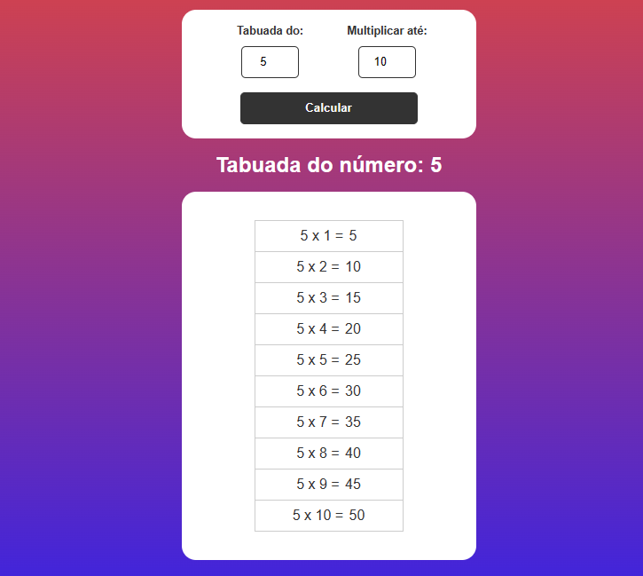

# Projeto: Tabuada - Js
O projeto desenvolvido apresenta o resultado da multiplicação para qualquer tipo de multiplicadores possível.  
O projeto possui um código de validação, que verifica se algum dos números da multiplicação é igual a zero, e consequentemente interrompendo a continuidade do programa.  

## Tecnologias:
HTML 
CSS 
JAVASCRIPT 
GIT/GITHUB 
